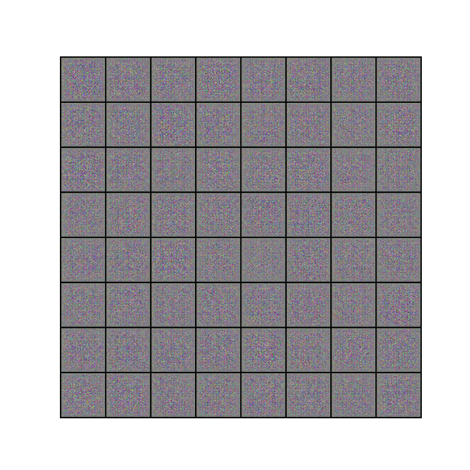

# Feature Extraction Using Unsupervised Learning Methods for Rice Grain Classification

This research explores the use of unsupervised learning methods in extracting features from an image.

### Unsupervised Learning Methods:
- PCA with CNN
- Convolutional Autoencoder (CAE) with CNN Classifier
- Generative Adverserial Network (GAN) with CNN Classifier

CAE and GAN used transfer learning for extracting features. CAE used the encoding layers for extracting the features from images while GAN used the discriminator layers.

## Results with Test Dataset
PCA: 20%

CAE (200 Latent Dimension): 94.83%

CAE (1000 Latent Dimension): 95.23%

GAN: 98.05%

### GAN RESULT

## Dataset Used

KOKLU, M., CINAR, I. and TASPINAR, Y. S. (2021). Classification of rice varieties with deep learning methods. Computers and Electronics in Agriculture, 187, 106285.
